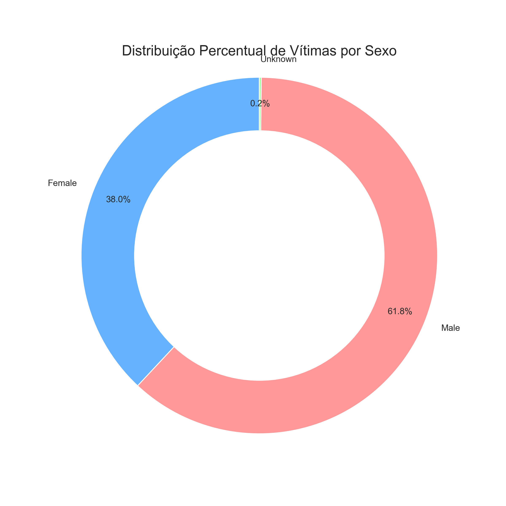
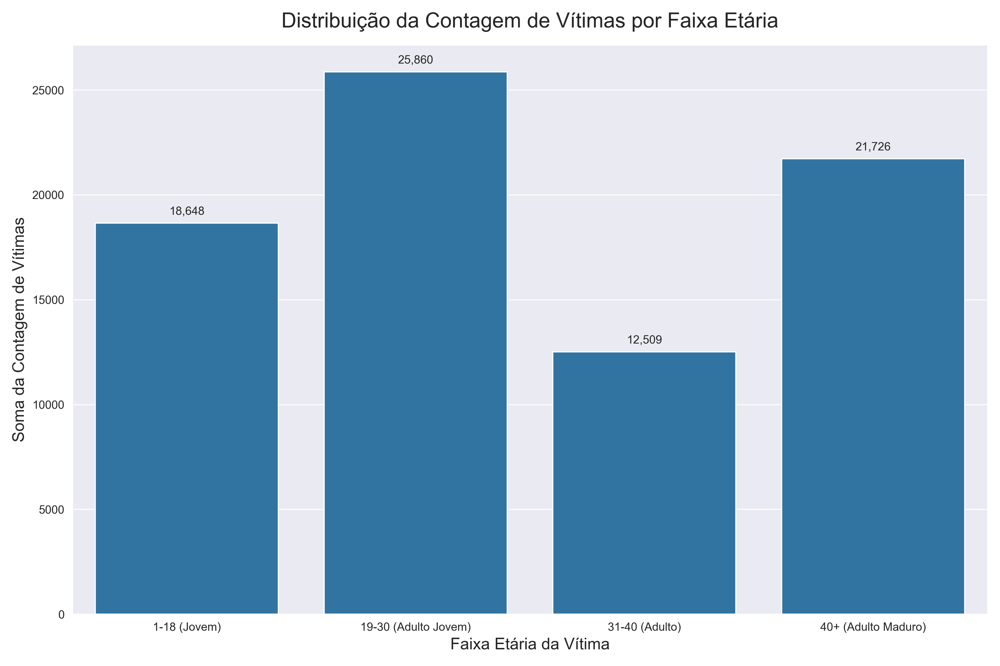

# Análise Exploratória de Homicídios nos Estados Unidos (1980-2014)

Este projeto realiza uma investigação detalhada sobre as dinâmicas de crimes violentos, perfis de vítimas, métodos utilizados e distribuições geográficas ao longo de três décadas nos EUA.

---

## 📌 Fonte dos Dados
* **Link Original:** [Acessar US Crime Dataset no Kaggle](https://www.kaggle.com/datasets/mrayushagrawal/us-crime-dataset)

---

## 📊 Análise Visual e Insights

### 📈 Evolução Temporal da Criminalidade
O gráfico abaixo ilustra a flutuação no volume de vítimas ao longo dos anos. Nota-se um pico histórico em meados da década de 90, seguido de uma nova tendência de crescimento a partir dos anos 2000.

  

### 👤 Perfil Demográfico das Vítimas
Estas visualizações detalham quem são as principais vítimas. Os dados mostram uma predominância de vítimas do sexo masculino e uma concentração significativa na faixa etária de jovens adultos.

  

  

### 🔫 Métodos Utilizados e Distribuição Racial
O revólver (Handgun) aparece como o principal instrumento, evidenciando o impacto das armas de fogo. A distribuição racial das vítimas mostra uma maioria de indivíduos brancos no acumulado total.

  

  

### 🔄 Dinâmica de Raça: Autor vs. Vítima (Crimes Intrarraciais)
Estes gráficos comparativos são cruciais para entender que o crime tende a ocorrer dentro do próprio grupo racial. Tanto para autores brancos quanto para autores negros, a maioria das vítimas pertence à mesma raça do agressor.

  

  

### 🗺️ Análise Regional e Concentração por Estado
A análise geográfica destaca o Sul como a região mais violenta em termos proporcionais. Nos números absolutos, estados com populações massivas como Califórnia e Texas lideram o ranking.

  

  

---

## 📝 Conclusões Principais

### Dinâmica Social
No grupo em que o autor é identificado como branco, a raça das vítimas é majoritariamente branca, indicando uma clara predominância de crimes intrarraciais. Da mesma forma, no grupo em que o autor é identificado como negro, observa-se que a maioria das vítimas também pertence à raça negra.

### Panorama Geográfico
A análise geográfica revela uma concentração crítica de ocorrências na região **Sul** dos Estados Unidos, que responde por aproximadamente **40%** das vítimas. Estados com grandes densidades populacionais como **Califórnia, Texas e New York** lideram o volume total de casos, sugerindo que fatores urbanos e socioeconômicos regionais exercem influência direta na criminalidade.

---

## 🛠️ Tecnologias Utilizadas
* **Python 3**
* **Pandas**: Manipulação de dados
* **Seaborn/Matplotlib**: Visualização de dados
* **Jupyter Notebook**: Ambiente de desenvolvimento
